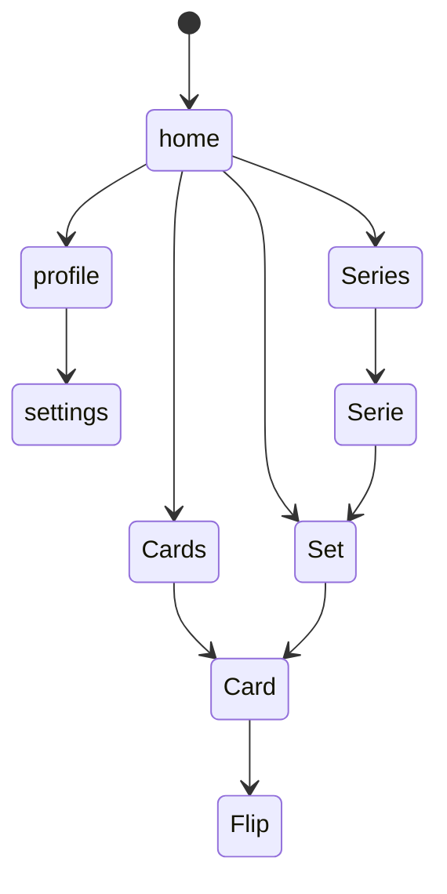

{ height=100px }
# pokedeck

A new Flutter project that use the information from https://tcgdex.dev/


## Navegation and organization





## Technical Information

### Directories inside `lib/`

    - **models/**: Contains data models used throughout the application.
    - **screens/**: Includes all the UI screens for the app.
    - **widgets/**: Reusable UI components.
    - **services/**: Handles API calls and business logic.
    - **utils/**: Utility functions and helpers.
    - **providers/**: State management logic.
    - **routes/**: Defines navigation routes for the app.
    - **themes/**: Contains theme-related files like colors and styles.

### Dependencies

```yaml
- flutter: ^3.7.2
- flutter_launcher_icons: ^0.14.4
- flutter_tts: ^4.2.3
- http: ^1.4.0
- flutter_test: ^3.7.2
- flutter_lints: ^5.0.0
- connectivity_plus: ^6.1.4
- google_fonts: ^6.2.1
```